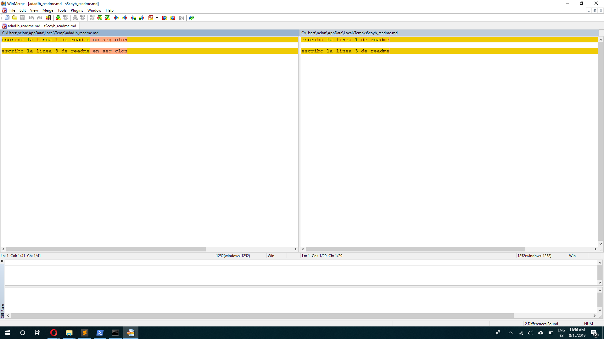
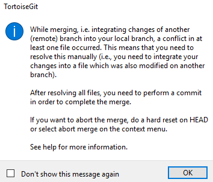
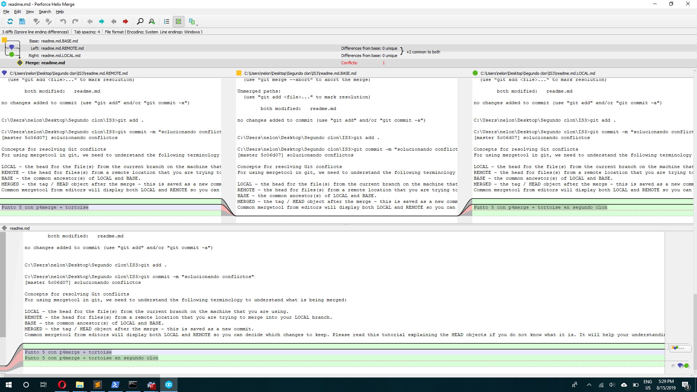
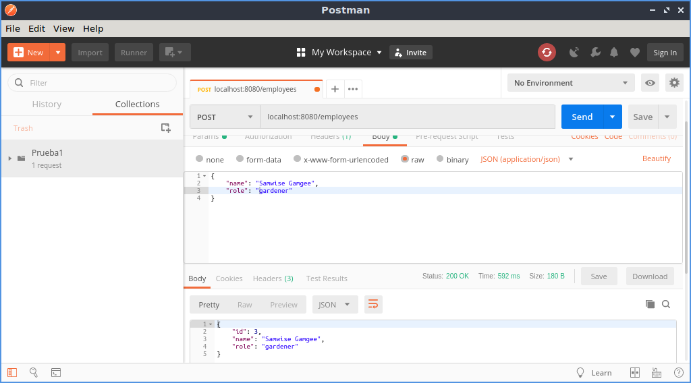

## Trabajo Práctico 1 - Git Básico

#### 1- Instalar Git

#### 2- Crear un repositorio local y agregar archivos
	git init
	touch readme.md
	git add .
	git commit -m "agregando readme"

#### 3- Crear un repositorio remoto
	git remote add origin https://github.com/NNelo/IS3.git
	git push -u origin master

#### 4- Familiarizarse con el concepto de Pull Request
	git push origin rama1
	pull request
	merge on github

	Refinición de "pull request"
		En un contexto de un repositorio con varias ramas, se puede querer que cierto código en alguna de las ramas (ej: RAMA A) en otra rama (llamemos RAMA B). Para cumplir con tal comedido, se puede hacer un pull request. Esto consiste en que la rama A solicita enviar código a la rama B, quien la unirá luego con un Merge

https://help.github.com/en/articles/about-pull-requests#about-pull-requests


#### 5- Mergear código con conflictos

```bash
$>Segundo clon\IS3>git commit -m "Se agregan lineas 1 y 3 a readme en segundo clon"
[master 40b28bb] Se agregan lineas 1 y 3 a readme en segundo clon
 1 file changed, 3 insertions(+)

ERROR

$>Segundo clon\IS3>git push
To https://github.com/NNelo/IS3.git
 ! [rejected]        master -> master (fetch first)
error: failed to push some refs to 'https://github.com/NNelo/IS3.git'
hint: Updates were rejected because the remote contains work that you do
hint: not have locally. This is usually caused by another repository pushing
hint: to the same ref. You may want to first integrate the remote changes
hint: (e.g., 'git pull ...') before pushing again.
hint: See the 'Note about fast-forwards' in 'git push --help' for details.

WinMerge
[diff]
    tool = winmerge
[difftool "winmerge"]
	cmd = "'C:/Program Files (x86)/WinMerge/WinMergeU.exe'" -e "$LOCAL" "$REMOTE"

C:\Users\nelon\Desktop\Segundo clon\IS3>git difftool HEAD HEAD~1

Viewing (1/1): 'readme.md'
Launch 'winmerge' [Y/n]? y



C:\Users\nelon\Desktop\Segundo clon\IS3>git status
On branch master
Your branch and 'origin/master' have diverged,
and have 2 and 1 different commits each, respectively.
  (use "git pull" to merge the remote branch into yours)

You have unmerged paths.
  (fix conflicts and run "git commit")
  (use "git merge --abort" to abort the merge)

Unmerged paths:
  (use "git add <file>..." to mark resolution)

        both modified:   readme.md

no changes added to commit (use "git add" and/or "git commit -a")


C:\Users\nelon\Desktop\Segundo clon\IS3>git add .

C:\Users\nelon\Desktop\Segundo clon\IS3>git commit -m "solucionando conflictos"
[master 5c06d07] solucionando conflictos
```

Segundo intento usando p4merge + tortoise en segundo clon

```bash
C:\Users\nelon\Desktop\Segundo clon\IS3>git commit -m "modificando readme desde clon 2"
[master 16204ba] modificando readme desde clon 2
 1 file changed, 3 insertions(+)

C:\Users\nelon\Desktop\Segundo clon\IS3>git push
To https://github.com/NNelo/IS3.git
 ! [rejected]        master -> master (fetch first)
error: failed to push some refs to 'https://github.com/NNelo/IS3.git'
hint: Updates were rejected because the remote contains work that you do
hint: not have locally. This is usually caused by another repository pushing
hint: to the same ref. You may want to first integrate the remote changes
hint: (e.g., 'git pull ...') before pushing again.
hint: See the 'Note about fast-forwards' in 'git push --help' for details.
```

tortoise pull 



solving conflicts



LOCAL - the head for the file(s) from the current branch on the machine that you are using.
REMOTE - the head for files(s) from a remote location that you are trying to merge into your LOCAL branch.
BASE - the common ancestor(s) of LOCAL and BASE.
MERGED - the tag / HEAD object after the merge - this is saved as a new commit.

## Trabajo Práctico 2 - Herramientas de construcción de software

#### 1- Instalar Java JDK si no dispone del mismo. 

```bash
sudo apt install && sudo apt upgrade
sudo apt install default-jre
sudo apt install default-jdk
```

#### 2- Instalar Maven

```bash
sudo apt install maven 
```

.profile
```bash
export PATH=/opt/apache-maven-3.6.1/bin:$PAT
```

#### 3- Introducción a Maven

- Qué es Maven?
Maven es una evolución de un par de herramientas para construir aplicaciones java. Sirve para, entre otras cosas, compilar programas. Esencialmente: construir aplicaciones java. Standalone, web. 
El objetivo de Maven es simplificar los procesos de build (compilar y generar ejecutables a partir del código fuente). Antes de su presencia cada proyecto solía tener alguna persona dedicada exclusivamente a configurar el proceso de build que debía analizar qué partes de código se debían compilar, qué librerías utilizaba el código, dónde incluirlas, qué dependencias de compilación había en el proyecto

- Qué es el archivo POM?
Receta de lo que quiero construir. Define los pasos de la ejecución de un	build. Define qué hacer y no cómo hacerlo (no es procedural).
Por otra parte, con Maven la gestión de dependencias entre módulos y distintas versiones de librerías se hace muy sencilla. En este caso, solo tenemos que indicar los módulos que componen el proyecto, o qué librerías utiliza el software que estamos desarrollando en un fichero de configuración de Maven del proyecto llamado POM.

	- modelVersion: determina qué versión de POM se está utilizando.
	- groupId: un identificador único dentro de una misma organización o proyecto.
	- artifactId: es el nombre con el que se conoce el proyecto.
	- versionId: denota qué pieza de software se utiliza respecto del tiempo.

- Repositorios Local, Central y Remotos 
http://maven.apache.org/guides/introduction/introduction-to-repositories.html
De donde maven saca las dependencias.
	- Central: todo lo abierto.
	- Local: cache de versiones locales en la maquina (mismo checksum, mismo jar). Evita tener que descargar reiteradas veces
	- Remoto: un servidor maven privado. Por compañía

- Entender Ciclos de vida de build
Son definiciones de pasos que hace maven, se ven como comandos. 
 
Maven se basa en los conceptos de ciclos de vida de build, lo que permite definir claramente los procesos de build y distribución de cada proyecto particularmente. En este sentido, sólo es necesario establecer algún conjunto de comandos (en el POM) para que Maven buildee cualquier proyecto
Existen tres tipos de ciclos de vida de build:
	- default: se encarga del deploy del proyecto.
 	- clean: se encarga de la limpieza del proyecto
	- site: se encarga de la creación de la documentación del proyecto

	- Referencia: http://maven.apache.org/guides/introduction/introduction-to-the-lifecycle.html#Build_Lifecycle_Basics

- Comprender las fases de un ciclo de vida, por ejemplo, default:

| Fase de build | Descripción                                                                                                                            |
|---------------|----------------------------------------------------------------------------------------------------------------------------------------|
| validate      | valida si el proyecto está correcto y toda la información está disponible                                                             |
| compile       | compila el código fuente del proyecto                                                                                 |
| test          | prueba el código fuente compilado utilizando un marco de prueba de unidad adecuado. Estas pruebas no deberían requerir que el código se empaquete o implemente |
| package       | toma el código compilado y lo empaquéta en su formato distribuible, como un JAR.                                                     |
| verify        | ejecuta cualquier verificación de los resultados de las pruebas de integración para garantizar que se cumplan los criterios de calidad                                                      |
| install       | instal1 el paquete en el repositorio local, para usarlo como dependencia en otros proyectos localmente                                       |
| deploy        | hecho en el entorno de compilación, copia el paquete final en el repositorio remoto para compartirlo con otros desarrolladores y proyectos.      |

- Copiar el siguiente contenido a un archivo, por ejemplo ./trabajo-practico-02/maven/vacio/pom.xml

```xml
<project xmlns="http://maven.apache.org/POM/4.0.0"
         xmlns:xsi="http://www.w3.org/2001/XMLSchema-instance"
         xsi:schemaLocation="http://maven.apache.org/POM/4.0.0
                      http://maven.apache.org/xsd/maven-4.0.0.xsd">
    <modelVersion>4.0.0</modelVersion>

    <groupId>ar.edu.ucc</groupId>
    <artifactId>proyecto-01</artifactId>
    <version>0.1-SNAPSHOT</version>
</project>
```

- Ejecutar el siguiente comando en el directorio donde se encuentra el archivo pom.xml
```
mvn clean install
```

```bash

C:\Users\nelon\Desktop\TP2-maven\maven\vacio>mvn clean install
[INFO] Scanning for projects...
[INFO]
[INFO] -----------------------< ar.edu.ucc:proyecto-01 >-----------------------
[INFO] Building proyecto-01 0.1-SNAPSHOT
[INFO] --------------------------------[ jar ]---------------------------------
[INFO]
[INFO] --- maven-clean-plugin:2.5:clean (default-clean) @ proyecto-01 ---
[INFO] Deleting C:\Users\nelon\Desktop\TP2-maven\maven\vacio\target
[INFO]
[INFO] --- maven-resources-plugin:2.6:resources (default-resources) @ proyecto-01 ---
[WARNING] Using platform encoding (Cp1252 actually) to copy filtered resources, i.e. build is platform dependent!
[INFO] skip non existing resourceDirectory C:\Users\nelon\Desktop\TP2-maven\maven\vacio\src\main\resources
[INFO]
[INFO] --- maven-compiler-plugin:3.1:compile (default-compile) @ proyecto-01 ---
[INFO] No sources to compile
[INFO]
[INFO] --- maven-resources-plugin:2.6:testResources (default-testResources) @ proyecto-01 ---
[WARNING] Using platform encoding (Cp1252 actually) to copy filtered resources, i.e. build is platform dependent!
[INFO] skip non existing resourceDirectory C:\Users\nelon\Desktop\TP2-maven\maven\vacio\src\test\resources
[INFO]
[INFO] --- maven-compiler-plugin:3.1:testCompile (default-testCompile) @ proyecto-01 ---
[INFO] No sources to compile
[INFO]
[INFO] --- maven-surefire-plugin:2.12.4:test (default-test) @ proyecto-01 ---
[INFO] No tests to run.
[INFO]
[INFO] --- maven-jar-plugin:2.4:jar (default-jar) @ proyecto-01 ---
[WARNING] JAR will be empty - no content was marked for inclusion!
[INFO] Building jar: C:\Users\nelon\Desktop\TP2-maven\maven\vacio\target\proyecto-01-0.1-SNAPSHOT.jar
[INFO]
[INFO] --- maven-install-plugin:2.4:install (default-install) @ proyecto-01 ---
[INFO] Installing C:\Users\nelon\Desktop\TP2-maven\maven\vacio\target\proyecto-01-0.1-SNAPSHOT.jar to C:\Users\nelon\.m2\repository\ar\edu\ucc\proyecto-01\0.1-SNAPSHOT\proyecto-01-0.1-SNAPSHOT.jar
[INFO] Installing C:\Users\nelon\Desktop\TP2-maven\maven\vacio\pom.xml to C:\Users\nelon\.m2\repository\ar\edu\ucc\proyecto-01\0.1-SNAPSHOT\proyecto-01-0.1-SNAPSHOT.pom
[INFO] ------------------------------------------------------------------------
[INFO] BUILD SUCCESS
[INFO] ------------------------------------------------------------------------
[INFO] Total time:  20.488 s
[INFO] Finished at: 2019-08-17T21:30:55-03:00
[INFO] ------------------------------------------------------------------------
```

- Sacar conclusiones del resultado

Analicemos el comando ejecutado, la instrucción install determina que debe ejecutarse el ciclo de vida default en orden (validate, compile, test, package, verify, install), el resultado será el proyecto compilado y empaquetado para ser usado a nivel local, directamente o como dependencia de otros proyectos. 
El comando clean que lo precede indica que el proyecto debe ser limpiado antes de comenzar las etapas mencionadas anteriormente. Esta limpieza implica remover todos los archivos generados por el build que se haya hecho previamente. En conclusión, el proyecto pasa previamente por el ciclo de clean antes del default.

La estructura del proyecto queda como sigue
```
netbook@netbook-pc:~/Desktop/trabajo-practico-02/maven/vacio$ tree
.
├── pom.xml
└── target
    ├── maven-archiver
    │   └── pom.properties
    └── proyecto-01-0.1-SNAPSHOT.jar

2 directories, 3 files
```


#### 4- Maven Continuación

- Generar un proyecto con una estructura inicial

```
netbook@netbook-pc:~/Desktop/trabajo-practico-02/maven/ejemplo$ mvn archetype:generate -DgroupId=ar.edu.ucc -DartifactId=ejemplo -DarchetypeArtifactId=maven-archetype-quickstart -DinteractiveMode=false

WARNING: An illegal reflective access operation has occurred
WARNING: Illegal reflective access by com.google.inject.internal.cglib.core.$ReflectUtils$1 (file:/usr/share/maven/lib/guice.jar) to method java.lang.ClassLoader.defineClass(java.lang.String,byte[],int,int,java.security.ProtectionDomain)
WARNING: Please consider reporting this to the maintainers of com.google.inject.internal.cglib.core.$ReflectUtils$1
WARNING: Use --illegal-access=warn to enable warnings of further illegal reflective access operations
WARNING: All illegal access operations will be denied in a future release
[INFO] Scanning for projects...
Downloading from central: https://repo.maven.apache.org/maven2/org/apache/maven/plugins/maven-deploy-plugin/2.7/maven-deploy-plugin-2.7.pom
.
.
.
Downloaded from central: https://repo.maven.apache.org/maven2/org/apache/maven/plugins/maven-archetype-plugin/3.1.2/maven-archetype-plugin-3.1.2.jar (97 kB at 91 kB/s)
[INFO] 
[INFO] ------------------< org.apache.maven:standalone-pom >-------------------
[INFO] Building Maven Stub Project (No POM) 1
[INFO] --------------------------------[ pom ]---------------------------------
[INFO] 
[INFO] >>> maven-archetype-plugin:3.1.2:generate (default-cli) > generate-sources @ standalone-pom >>>
[INFO] 
[INFO] <<< maven-archetype-plugin:3.1.2:generate (default-cli) < generate-sources @ standalone-pom <<<
[INFO] 
[INFO] 
[INFO] --- maven-archetype-plugin:3.1.2:generate (default-cli) @ standalone-pom ---
Downloading from central: https://repo.maven.apache.org/maven2/org/apache/maven/archetype/archetype-catalog/3.1.2/archetype-catalog-3.1.2.pom
.
.
.
Downloaded from central: https://repo.maven.apache.org/maven2/org/apache/ant/ant/1.8.1/ant-1.8.1.jar (1.5 MB at 140 kB/s)
[INFO] Generating project in Batch mode
Downloading from central: https://repo.maven.apache.org/maven2/org/apache/maven/archetypes/maven-archetype-quickstart/1.0/maven-archetype-quickstart-1.0.pom
.
.
.
Downloaded from central: https://repo.maven.apache.org/maven2/org/apache/maven/archetypes/maven-archetype-quickstart/1.0/maven-archetype-quickstart-1.0.jar (4.3 kB at 5.8 kB/s)
[INFO] ----------------------------------------------------------------------------
[INFO] Using following parameters for creating project from Old (1.x) Archetype: maven-archetype-quickstart:1.0
[INFO] ----------------------------------------------------------------------------
[INFO] Parameter: basedir, Value: /home/netbook/Desktop/trabajo-practico-02/maven/ejemplo
[INFO] Parameter: package, Value: ar.edu.ucc
[INFO] Parameter: groupId, Value: ar.edu.ucc
[INFO] Parameter: artifactId, Value: ejemplo
[INFO] Parameter: packageName, Value: ar.edu.ucc
[INFO] Parameter: version, Value: 1.0-SNAPSHOT
[INFO] project created from Old (1.x) Archetype in dir: /home/netbook/Desktop/trabajo-practico-02/maven/ejemplo/ejemplo
[INFO] ------------------------------------------------------------------------
[INFO] BUILD SUCCESS
[INFO] ------------------------------------------------------------------------
[INFO] Total time:  01:31 min
[INFO] Finished at: 2019-10-02T23:03:20-03:00
[INFO] ------------------------------------------------------------------------

```

- La estructura generada es la siguiente
```
netbook@netbook-pc:~/Desktop/trabajo-practico-02/maven/ejemplo$ tree
.
└── ejemplo
    ├── pom.xml
    └── src
        ├── main
        │   └── java
        │       └── ar
        │           └── edu
        │               └── ucc
        │                   └── App.java
        └── test
            └── java
                └── ar
                    └── edu
                        └── ucc
                            └── AppTest.java

12 directories, 3 files
```

- Compilar el proyecto
```
netbook@netbook-pc:~/Desktop/trabajo-practico-02/maven/ejemplo/ejemplo$ mvn clean package
WARNING: An illegal reflective access operation has occurred
WARNING: Illegal reflective access by com.google.inject.internal.cglib.core.$ReflectUtils$1 (file:/usr/share/maven/lib/guice.jar) to method java.lang.ClassLoader.defineClass(java.lang.String,byte[],int,int,java.security.ProtectionDomain)
WARNING: Please consider reporting this to the maintainers of com.google.inject.internal.cglib.core.$ReflectUtils$1
WARNING: Use --illegal-access=warn to enable warnings of further illegal reflective access operations
WARNING: All illegal access operations will be denied in a future release
[INFO] Scanning for projects...
[INFO] 
[INFO] -------------------------< ar.edu.ucc:ejemplo >-------------------------
[INFO] Building ejemplo 1.0-SNAPSHOT
[INFO] --------------------------------[ jar ]---------------------------------
[INFO] 
[INFO] --- maven-clean-plugin:2.5:clean (default-clean) @ ejemplo ---
[INFO] 
[INFO] --- maven-resources-plugin:2.6:resources (default-resources) @ ejemplo ---
[WARNING] Using platform encoding (UTF-8 actually) to copy filtered resources, i.e. build is platform dependent!
[INFO] skip non existing resourceDirectory /home/netbook/Desktop/trabajo-practico-02/maven/ejemplo/ejemplo/src/main/resources
[INFO] 
[INFO] --- maven-compiler-plugin:3.1:compile (default-compile) @ ejemplo ---
[INFO] Changes detected - recompiling the module!
[WARNING] File encoding has not been set, using platform encoding UTF-8, i.e. build is platform dependent!
[INFO] Compiling 1 source file to /home/netbook/Desktop/trabajo-practico-02/maven/ejemplo/ejemplo/target/classes
[INFO] -------------------------------------------------------------
[ERROR] COMPILATION ERROR : 
[INFO] -------------------------------------------------------------
[ERROR] Source option 5 is no longer supported. Use 6 or later.
[ERROR] Target option 1.5 is no longer supported. Use 1.6 or later.
[INFO] 2 errors 
[INFO] -------------------------------------------------------------
[INFO] ------------------------------------------------------------------------
[INFO] BUILD FAILURE
[INFO] ------------------------------------------------------------------------
[INFO] Total time:  12.096 s
[INFO] Finished at: 2019-10-02T23:08:39-03:00
[INFO] ------------------------------------------------------------------------
[ERROR] Failed to execute goal org.apache.maven.plugins:maven-compiler-plugin:3.1:compile (default-compile) on project ejemplo: Compilation failure: Compilation failure: 
[ERROR] Source option 5 is no longer supported. Use 6 or later.
[ERROR] Target option 1.5 is no longer supported. Use 1.6 or later.
[ERROR] -> [Help 1]
[ERROR] 
[ERROR] To see the full stack trace of the errors, re-run Maven with the -e switch.
[ERROR] Re-run Maven using the -X switch to enable full debug logging.
[ERROR] 
[ERROR] For more information about the errors and possible solutions, please read the following articles:
[ERROR] [Help 1] http://cwiki.apache.org/confluence/display/MAVEN/MojoFailureException
```

Modifico el pom.xml, quedando como sigue
```
netbook@netbook-pc:~/Desktop/trabajo-practico-02/maven/ejemplo$ cat pom.xml 
<project xmlns="http://maven.apache.org/POM/4.0.0" xmlns:xsi="http://www.w3.org/2001/XMLSchema-instance"
  xsi:schemaLocation="http://maven.apache.org/POM/4.0.0 http://maven.apache.org/maven-v4_0_0.xsd">
  <modelVersion>4.0.0</modelVersion>
  <groupId>ar.edu.ucc</groupId>
  <artifactId>ejemplo</artifactId>
*********************************************************
* <properties>											*
*   <maven.compiler.source>1.6</maven.compiler.source>	*
*   <maven.compiler.target>1.6</maven.compiler.target>	*
*  </properties>										*
*********************************************************
  <packaging>jar</packaging>
  <version>1.0-SNAPSHOT</version>
  <name>ejemplo</name>
  <url>http://maven.apache.org</url>
  <dependencies>
    <dependency>
      <groupId>junit</groupId>
      <artifactId>junit</artifactId>
      <version>3.8.1</version>
      <scope>test</scope>
    </dependency>
  </dependencies>  
</project>

```

Ahora intentando, nuevamente compilar el proyecto

```
netbook@netbook-pc:~/Desktop/trabajo-practico-02/maven/ejemplo$ mvn clean package
WARNING: An illegal reflective access operation has occurred
WARNING: Illegal reflective access by com.google.inject.internal.cglib.core.$ReflectUtils$1 (file:/usr/share/maven/lib/guice.jar) to method java.lang.ClassLoader.defineClass(java.lang.String,byte[],int,int,java.security.ProtectionDomain)
WARNING: Please consider reporting this to the maintainers of com.google.inject.internal.cglib.core.$ReflectUtils$1
WARNING: Use --illegal-access=warn to enable warnings of further illegal reflective access operations
WARNING: All illegal access operations will be denied in a future release
[INFO] Scanning for projects...
[INFO] 
[INFO] -------------------------< ar.edu.ucc:ejemplo >-------------------------
[INFO] Building ejemplo 1.0-SNAPSHOT
[INFO] --------------------------------[ jar ]---------------------------------
[INFO] 
[INFO] --- maven-clean-plugin:2.5:clean (default-clean) @ ejemplo ---
[INFO] Deleting /home/netbook/Desktop/trabajo-practico-02/maven/ejemplo/target
[INFO] 
[INFO] --- maven-resources-plugin:2.6:resources (default-resources) @ ejemplo ---
[WARNING] Using platform encoding (UTF-8 actually) to copy filtered resources, i.e. build is platform dependent!
[INFO] skip non existing resourceDirectory /home/netbook/Desktop/trabajo-practico-02/maven/ejemplo/src/main/resources
[INFO] 
[INFO] --- maven-compiler-plugin:3.1:compile (default-compile) @ ejemplo ---
[INFO] Changes detected - recompiling the module!
[WARNING] File encoding has not been set, using platform encoding UTF-8, i.e. build is platform dependent!
[INFO] Compiling 1 source file to /home/netbook/Desktop/trabajo-practico-02/maven/ejemplo/target/classes
[INFO] 
[INFO] --- maven-resources-plugin:2.6:testResources (default-testResources) @ ejemplo ---
[WARNING] Using platform encoding (UTF-8 actually) to copy filtered resources, i.e. build is platform dependent!
[INFO] skip non existing resourceDirectory /home/netbook/Desktop/trabajo-practico-02/maven/ejemplo/src/test/resources
[INFO] 
[INFO] --- maven-compiler-plugin:3.1:testCompile (default-testCompile) @ ejemplo ---
[INFO] Changes detected - recompiling the module!
[WARNING] File encoding has not been set, using platform encoding UTF-8, i.e. build is platform dependent!
[INFO] Compiling 1 source file to /home/netbook/Desktop/trabajo-practico-02/maven/ejemplo/target/test-classes
[INFO] 
[INFO] --- maven-surefire-plugin:2.12.4:test (default-test) @ ejemplo ---
[INFO] Surefire report directory: /home/netbook/Desktop/trabajo-practico-02/maven/ejemplo/target/surefire-reports
Downloading from central: https://repo.maven.apache.org/maven2/org/apache/maven/surefire/surefire-junit3/2.12.4/surefire-junit3-2.12.4.pom
Downloaded from central: https://repo.maven.apache.org/maven2/org/apache/maven/surefire/surefire-junit3/2.12.4/surefire-junit3-2.12.4.pom (1.7 kB at 202 B/s)
Downloading from central: https://repo.maven.apache.org/maven2/org/apache/maven/surefire/surefire-providers/2.12.4/surefire-providers-2.12.4.pom
Downloaded from central: https://repo.maven.apache.org/maven2/org/apache/maven/surefire/surefire-providers/2.12.4/surefire-providers-2.12.4.pom (2.3 kB at 4.4 kB/s)
Downloading from central: https://repo.maven.apache.org/maven2/org/apache/maven/surefire/surefire-junit3/2.12.4/surefire-junit3-2.12.4.jar
Downloaded from central: https://repo.maven.apache.org/maven2/org/apache/maven/surefire/surefire-junit3/2.12.4/surefire-junit3-2.12.4.jar (26 kB at 43 kB/s)

-------------------------------------------------------
 T E S T S
-------------------------------------------------------
Running ar.edu.ucc.AppTest
Tests run: 1, Failures: 0, Errors: 0, Skipped: 0, Time elapsed: 0.188 sec

Results :

Tests run: 1, Failures: 0, Errors: 0, Skipped: 0

[INFO] 
[INFO] --- maven-jar-plugin:2.4:jar (default-jar) @ ejemplo ---
[INFO] Building jar: /home/netbook/Desktop/trabajo-practico-02/maven/ejemplo/target/ejemplo-1.0-SNAPSHOT.jar
[INFO] ------------------------------------------------------------------------
[INFO] BUILD SUCCESS
[INFO] ------------------------------------------------------------------------
[INFO] Total time:  37.425 s
[INFO] Finished at: 2019-10-02T23:27:15-03:00
[INFO] ------------------------------------------------------------------------

```
Analizando el resultado del comando anterior encontramos que el proyecto se compiló, también se descargaron los archivos necesarios para poder hacer el build. Al final, se ejecutan un conjunto de tests y luego se procede con la construcción del jar (ejecutable)
Podemos observar cómo queda la estructura del proyecto luego del build. 

```
netbook@netbook-pc:~/Desktop/trabajo-practico-02/maven/ejemplo$ tree
.
├── pom.xml
├── src
│   ├── main
│   │   └── java
│   │       └── ar
│   │           └── edu
│   │               └── ucc
│   │                   └── App.java
│   └── test
│       └── java
│           └── ar
│               └── edu
│                   └── ucc
│                       └── AppTest.java
└── target
    ├── classes
    │   └── ar
    │       └── edu
    │           └── ucc
    │               └── App.class
    ├── ejemplo-1.0-SNAPSHOT.jar
    ├── generated-sources
    │   └── annotations
    ├── generated-test-sources
    │   └── test-annotations
    ├── maven-archiver
    │   └── pom.properties
    ├── maven-status
    │   └── maven-compiler-plugin
    │       ├── compile
    │       │   └── default-compile
    │       │       ├── createdFiles.lst
    │       │       └── inputFiles.lst
    │       └── testCompile
    │           └── default-testCompile
    │               ├── createdFiles.lst
    │               └── inputFiles.lst
    ├── surefire-reports
    │   ├── ar.edu.ucc.AppTest.txt
    │   └── TEST-ar.edu.ucc.AppTest.xml
    └── test-classes
        └── ar
            └── edu
                └── ucc
                    └── AppTest.class

32 directories, 13 files
```

En esta estructura observamos que se genera un nuevo directorio "target" con los resultados del proceso de compilación. Ponemos especial énfasis en la aparición del archivo "ejemplo-1.0-SNAPSHOT.jar", el ejecutable.

- Ejecutar el programa
```
netbook@netbook-pc:~/Desktop/trabajo-practico-02/maven/ejemplo$ java -cp target/ejemplo-1.0-SNAPSHOT.jar ar.edu.ucc.App
Hello World!
```

El parámetro "-cp" (class path) permite especificar cuál clase deberá ser tomada como la main.


#### 6- Manejo de dependencias

- Crear un nuevo proyecto con artifactId ejemplo-uber-jar

```
netbook@netbook-pc:~/Desktop/trabajo-practico-02/maven$ mvn archetype:generate -DgroupId=ar.edu.ucc -DartifactId=ejemplo-uber-jar -DarchetypeArtifactId=maven-archetype-quickstart -DinteractiveMode=false
```

Modificar el código de App.java para agregar utilizar una librería de logging:

```
package ar.edu.ucc;

import org.slf4j.Logger;
import org.slf4j.LoggerFactory;

/**
 * Hello world!
 *
 */
public class App 
{
    public static void main( String[] args )
    {
        Logger log = LoggerFactory.getLogger(App.class);
        log.info("Hola Mundo!");
    }
}
```

- Compilar el código e identificar el problema.

Obervación: se modifica el pom.xml igual que para el punto anterior

```
netbook@netbook-pc:~/Desktop/trabajo-practico-02/maven/ejemplo-uber-jar$ mvn clean package
WARNING: An illegal reflective access operation has occurred
WARNING: Illegal reflective access by com.google.inject.internal.cglib.core.$ReflectUtils$1 (file:/usr/share/maven/lib/guice.jar) to method java.lang.ClassLoader.defineClass(java.lang.String,byte[],int,int,java.security.ProtectionDomain)
WARNING: Please consider reporting this to the maintainers of com.google.inject.internal.cglib.core.$ReflectUtils$1
WARNING: Use --illegal-access=warn to enable warnings of further illegal reflective access operations
WARNING: All illegal access operations will be denied in a future release
[INFO] Scanning for projects...
[INFO] 
[INFO] --------------------< ar.edu.ucc:ejemplo-uber-jar >---------------------
[INFO] Building ejemplo-uber-jar 1.0-SNAPSHOT
[INFO] --------------------------------[ jar ]---------------------------------
[INFO] 
[INFO] --- maven-clean-plugin:2.5:clean (default-clean) @ ejemplo-uber-jar ---
[INFO] Deleting /home/netbook/Desktop/trabajo-practico-02/maven/ejemplo-uber-jar/target
[INFO] 
[INFO] --- maven-resources-plugin:2.6:resources (default-resources) @ ejemplo-uber-jar ---
[WARNING] Using platform encoding (UTF-8 actually) to copy filtered resources, i.e. build is platform dependent!
[INFO] skip non existing resourceDirectory /home/netbook/Desktop/trabajo-practico-02/maven/ejemplo-uber-jar/src/main/resources
[INFO] 
[INFO] --- maven-compiler-plugin:3.1:compile (default-compile) @ ejemplo-uber-jar ---
[INFO] Changes detected - recompiling the module!
[WARNING] File encoding has not been set, using platform encoding UTF-8, i.e. build is platform dependent!
[INFO] Compiling 1 source file to /home/netbook/Desktop/trabajo-practico-02/maven/ejemplo-uber-jar/target/classes
[INFO] -------------------------------------------------------------
[ERROR] COMPILATION ERROR : 
[INFO] -------------------------------------------------------------
[ERROR] /home/netbook/Desktop/trabajo-practico-02/maven/ejemplo-uber-jar/src/main/java/ar/edu/ucc/App.java:[3,17] package org.slf4j does not exist
[ERROR] /home/netbook/Desktop/trabajo-practico-02/maven/ejemplo-uber-jar/src/main/java/ar/edu/ucc/App.java:[4,17] package org.slf4j does not exist
[ERROR] /home/netbook/Desktop/trabajo-practico-02/maven/ejemplo-uber-jar/src/main/java/ar/edu/ucc/App.java:[14,9] cannot find symbol
  symbol:   class Logger
  location: class ar.edu.ucc.App
[ERROR] /home/netbook/Desktop/trabajo-practico-02/maven/ejemplo-uber-jar/src/main/java/ar/edu/ucc/App.java:[14,22] cannot find symbol
  symbol:   variable LoggerFactory
  location: class ar.edu.ucc.App
[INFO] 4 errors 
[INFO] -------------------------------------------------------------
[INFO] ------------------------------------------------------------------------
[INFO] BUILD FAILURE
[INFO] ------------------------------------------------------------------------
[INFO] Total time:  14.934 s
[INFO] Finished at: 2019-10-03T00:02:19-03:00
[INFO] ------------------------------------------------------------------------
[ERROR] Failed to execute goal org.apache.maven.plugins:maven-compiler-plugin:3.1:compile (default-compile) on project ejemplo-uber-jar: Compilation failure: Compilation failure: 
[ERROR] /home/netbook/Desktop/trabajo-practico-02/maven/ejemplo-uber-jar/src/main/java/ar/edu/ucc/App.java:[3,17] package org.slf4j does not exist
[ERROR] /home/netbook/Desktop/trabajo-practico-02/maven/ejemplo-uber-jar/src/main/java/ar/edu/ucc/App.java:[4,17] package org.slf4j does not exist
[ERROR] /home/netbook/Desktop/trabajo-practico-02/maven/ejemplo-uber-jar/src/main/java/ar/edu/ucc/App.java:[14,9] cannot find symbol
[ERROR]   symbol:   class Logger
[ERROR]   location: class ar.edu.ucc.App
[ERROR] /home/netbook/Desktop/trabajo-practico-02/maven/ejemplo-uber-jar/src/main/java/ar/edu/ucc/App.java:[14,22] cannot find symbol
[ERROR]   symbol:   variable LoggerFactory
[ERROR]   location: class ar.edu.ucc.App
[ERROR] -> [Help 1]
[ERROR] 
[ERROR] To see the full stack trace of the errors, re-run Maven with the -e switch.
[ERROR] Re-run Maven using the -X switch to enable full debug logging.
[ERROR] 
[ERROR] For more information about the errors and possible solutions, please read the following articles:
[ERROR] [Help 1] http://cwiki.apache.org/confluence/display/MAVEN/MojoFailureException
```
El error básicamente consiste en que al momento del build no se encuentra el componente "package org.slf4j"
Esto produce errores en la compilación, por lo que el proceso de build falla. 

- Agregar la dependencia necesaria al pom.xml

```
<project xmlns="http://maven.apache.org/POM/4.0.0" xmlns:xsi="http://www.w3.org/2001/XMLSchema-instance"
  xsi:schemaLocation="http://maven.apache.org/POM/4.0.0 http://maven.apache.org/maven-v4_0_0.xsd">
  <modelVersion>4.0.0</modelVersion>
  <groupId>ar.edu.ucc</groupId>
  <artifactId>ejemplo-uber-jar</artifactId>
  <properties>
    <maven.compiler.source>1.6</maven.compiler.source>
    <maven.compiler.target>1.6</maven.compiler.target>
  </properties>
  <packaging>jar</packaging>
  <version>1.0-SNAPSHOT</version>
  <name>ejemplo-uber-jar</name>
  <url>http://maven.apache.org</url>
  <dependencies>
    <dependency>
      <groupId>junit</groupId>
      <artifactId>junit</artifactId>
      <version>3.8.1</version>
      <scope>test</scope>
    </dependency>
*************************************************    
*    <dependency>								*
*      <groupId>ch.qos.logback</groupId>		*
*      <artifactId>logback-classic</artifactId>	*
*      <version>1.2.1</version>					*
*    </dependency>								*
*************************************************
  </dependencies>
</project>

```

Observaciones: ahora mvn clean package se ejectua sin inconvenientes.
Aparecen lineas como "Downloading from central: https://repo.maven.apache.org/maven2/org/slf4j/slf4j-api/1.7.22/slf4j-api-1.7.22.pom" que indican que se obtienen del repositorio central de Maven los archivos para cumplir con la dependencia

- Verificar si se genera el archivo jar y ejecutarlo

```
netbook@netbook-pc:~/Desktop/trabajo-practico-02/maven/ejemplo-uber-jar$ java -cp target/ejemplo-uber-jar-1.0-SNAPSHOT.jar ar.edu.ucc.App 
Exception in thread "main" java.lang.NoClassDefFoundError: org/slf4j/LoggerFactory
        at ar.edu.ucc.App.main(App.java:14)
Caused by: java.lang.ClassNotFoundException: org.slf4j.LoggerFactory
        at java.base/jdk.internal.loader.BuiltinClassLoader.loadClass(BuiltinClassLoader.java:583)
        at java.base/jdk.internal.loader.ClassLoaders$AppClassLoader.loadClass(ClassLoaders.java:178)
        at java.base/java.lang.ClassLoader.loadClass(ClassLoader.java:521)
        ... 1 more

```

- Sacar conclusiones y analizar posibles soluciones

El problema del comando anterior es un error de ejecución de Java. Se debe a la falta de una excepción de una clase faltante.

- Implementando una solución

Agregando al pom.xml según https://maven.apache.org/plugins/maven-shade-plugin/examples/includes-excludes.html

```
```
- Volver a generar la salida y probar ejecutando

```
netbook@netbook-pc:~/Desktop/trabajo-practico-02/maven/ejemplo-uber-jar$ mvn clean package 
(...)
netbook@netbook-pc:~/Desktop/trabajo-practico-02/maven/ejemplo-uber-jar$ java -cp target/ejemplo-uber-jar-1.0-SNAPSHOT.jar ar.edu.ucc.App 
00:21:40.276 [main] INFO ar.edu.ucc.App - Hola Mundo!
```

#### 7- Utilizar una IDE

#### 8- Build tools para otros lenguages

#### 9- Ejemplo con nodejs (Opcional, pero recomendando)

-Instalar Nodejs: https://nodejs.org/en/
```
netbook@netbook-pc:~/Guitar/IS3$ sudo apt install nodejs
netbook@netbook-pc:~/Guitar/IS3$ sudo apt install npm

netbook@netbook-pc:~/Guitar/IS3$ nodejs -v
v10.15.2
netbook@netbook-pc:~/Guitar/IS3$ npm -v
5.8.0	
```

-Instalar el componente para generar aplicaciones Express
```
netbook@netbook-pc:~/Guitar/IS3$ sudo npm install express-generator -g
npm WARN npm npm does not support Node.js v10.15.2
npm WARN npm You should probably upgrade to a newer version of node as we
npm WARN npm can't make any promises that npm will work with this version.
npm WARN npm Supported releases of Node.js are the latest release of 4, 6, 7, 8, 9.
npm WARN npm You can find the latest version at https://nodejs.org/
/usr/local/bin/express -> /usr/local/lib/node_modules/express-generator/bin/express-cli.js
+ express-generator@4.16.1
added 10 packages from 13 contributors in 6.515s
```

-Crear una nueva aplicación
```
netbook@netbook-pc:~/Guitar/IS3$ express --view=ejs hola-mundo
   create : hola-mundo/
   create : hola-mundo/public/
   create : hola-mundo/public/javascripts/
   create : hola-mundo/public/images/
   create : hola-mundo/public/stylesheets/
   create : hola-mundo/public/stylesheets/style.css
   create : hola-mundo/routes/
   create : hola-mundo/routes/index.js
   create : hola-mundo/routes/users.js
   create : hola-mundo/views/
   create : hola-mundo/views/error.ejs
   create : hola-mundo/views/index.ejs
   create : hola-mundo/app.js
   create : hola-mundo/package.json
   create : hola-mundo/bin/
   create : hola-mundo/bin/www

   change directory:
     $ cd hola-mundo

   install dependencies:
     $ npm install

   run the app:
     $ DEBUG=hola-mundo:* npm start

```
-Ejecutar la aplicación
```
netbook@netbook-pc:~/Guitar/IS3$ cd hola-mundo/

netbook@netbook-pc:~/Guitar/IS3/hola-mundo$ npm install 
npm WARN npm npm does not support Node.js v10.15.2
npm WARN npm You should probably upgrade to a newer version of node as we
npm WARN npm can't make any promises that npm will work with this version.
npm WARN npm Supported releases of Node.js are the latest release of 4, 6, 7, 8, 9.
npm WARN npm You can find the latest version at https://nodejs.org/
npm WARN notice [SECURITY] finalhandler has the following vulnerability: 1 low. Go here for more details: https://www.npmjs.com/advisories?search=finalhandler&version=1.1.1 - Run `npm i npm@latest -g` to upgrade your npm version, and then `npm audit` to get more info.
npm WARN tar write after end
npm notice created a lockfile as package-lock.json. You should commit this file.
added 53 packages from 36 contributors in 15.318s

netbook@netbook-pc:~/Guitar/IS3/hola-mundo$ npm start
npm WARN npm npm does not support Node.js v10.15.2
npm WARN npm You should probably upgrade to a newer version of node as we
npm WARN npm can't make any promises that npm will work with this version.
npm WARN npm Supported releases of Node.js are the latest release of 4, 6, 7, 8, 9.
npm WARN npm You can find the latest version at https://nodejs.org/

> hola-mundo@0.0.0 start /home/netbook/Guitar/IS3/hola-mundo
> node ./bin/www
```

-La aplicación web estará disponible en http://localhost:3000
```
netbook@netbook-pc:~/Guitar/IS3$ curl localhost:3000
<!DOCTYPE html>
<html>
  <head>
    <title>Express</title>
    <link rel='stylesheet' href='/stylesheets/style.css' />
  </head>
  <body>
    <h1>Express</h1>
    <p>Welcome to Express</p>
  </body>
</html>
```

-Analizar el manejo de paquetes y dependencias realizado por npm.

npm  is the package manager for the Node JavaScript platform.  It puts modules in place so that node can find them, and manages dependency conflicts intelligently.
It is extremely configurable to support a wide variety of use cases.  Most commonly, it is used to publish, discover, install, and develop node programs.

En definitiva, npm cumple las funciones que Maven hace para Java. Permite compilar, buildear y ejecutar las aplicaciones desarrolladas. En el caso de npm, las dependencias se declaran en un archivo package.json, que hace las veces del pom.xml. 

```
netbook@netbook-pc:~/Guitar/IS3/hola-mundo$ cat package.json 
{
  "name": "hola-mundo",
  "version": "0.0.0",
  "private": true,
  "scripts": {
    "start": "node ./bin/www"
  },
  "dependencies": {
    "cookie-parser": "~1.4.4",
    "debug": "~2.6.9",
    "ejs": "~2.6.1",
    "express": "~4.16.1",
    "http-errors": "~1.6.3",
    "morgan": "~1.9.1"
  }
}
```

Incluso la instalación del proyecto (con npm install), genera la carpeta "node_modules" que contiene todos los módulos necesarios para que la apliación pueda ser ejecutada en dicho entorno.


## Trabajo Práctico 3 - Software Distribuido - Servicios RESTful

#### 1- Configurar el IDE para trabajar con Spring

Usando Eclipse
	Spring Tools 4 - for Spring Boot (aka Spring Tol Suite 4) 4.4.0.RELEASE
	Lombok v1.18.8 "Envious Ferret" 

#### 2- Configurar la aplicación

- Importando nonrest como server en nuestro repositorio
```
netbook@netbook-pc:~/Guitar$ tree IS3/payroll
IS3/payroll
├── pom.xml
└── server
    ├── pom.xml
    └── src
        └── main
            └── java
                └── payroll
                    ├── EmployeeController.java
                    ├── Employee.java
                    ├── EmployeeNotFoundAdvice.java
                    ├── EmployeeNotFoundException.java
                    ├── EmployeeRepository.java
                    ├── LoadDatabase.java
                    └── PayrollApplication.java

5 directories, 9 files
```

- Compilando el proyecto

```
netbook@netbook-pc:~/Guitar/IS3/payroll/server$ mvn clean package spring-boot:repackage 
WARNING: An illegal reflective access operation has occurred
WARNING: Illegal reflective access by com.google.inject.internal.cglib.core.$ReflectUtils$1 (file:/usr/share/maven/lib/guice.jar) to method java.lang.ClassLoader.defineClass(java.lang.String,byte[],int,int,java.security.ProtectionDomain)
WARNING: Please consider reporting this to the maintainers of com.google.inject.internal.cglib.core.$ReflectUtils$1
WARNING: Use --illegal-access=warn to enable warnings of further illegal reflective access operations
WARNING: All illegal access operations will be denied in a future release
[INFO] Scanning for projects...
[INFO] 
[INFO] -----------------< org.springframework.guides:nonrest >-----------------
[INFO] Building nonrest 0.0.1-SNAPSHOT
[INFO] --------------------------------[ jar ]---------------------------------
[INFO] 
[INFO] --- maven-clean-plugin:3.1.0:clean (default-clean) @ nonrest ---
[INFO] Deleting /home/netbook/Guitar/IS3/payroll/server/target
[INFO] 
[INFO] --- maven-resources-plugin:3.1.0:resources (default-resources) @ nonrest ---
[INFO] Using 'UTF-8' encoding to copy filtered resources.
[INFO] skip non existing resourceDirectory /home/netbook/Guitar/IS3/payroll/server/src/main/resources
[INFO] skip non existing resourceDirectory /home/netbook/Guitar/IS3/payroll/server/src/main/resources
[INFO] 
[INFO] --- maven-compiler-plugin:3.8.1:compile (default-compile) @ nonrest ---
[INFO] Changes detected - recompiling the module!
[INFO] Compiling 7 source files to /home/netbook/Guitar/IS3/payroll/server/target/classes
[INFO] 
[INFO] --- maven-resources-plugin:3.1.0:testResources (default-testResources) @ nonrest ---
[INFO] Using 'UTF-8' encoding to copy filtered resources.
[INFO] skip non existing resourceDirectory /home/netbook/Guitar/IS3/payroll/server/src/test/resources
[INFO] 
[INFO] --- maven-compiler-plugin:3.8.1:testCompile (default-testCompile) @ nonrest ---
[INFO] No sources to compile
[INFO] 
[INFO] --- maven-surefire-plugin:2.22.2:test (default-test) @ nonrest ---
[INFO] No tests to run.
[INFO] 
[INFO] --- maven-jar-plugin:3.1.2:jar (default-jar) @ nonrest ---
[INFO] Building jar: /home/netbook/Guitar/IS3/payroll/server/target/nonrest-0.0.1-SNAPSHOT.jar
[INFO] 
[INFO] --- spring-boot-maven-plugin:2.1.9.RELEASE:repackage (repackage) @ nonrest ---
[INFO] Replacing main artifact with repackaged archive
[INFO] 
[INFO] --- spring-boot-maven-plugin:2.1.9.RELEASE:repackage (default-cli) @ nonrest ---
[INFO] Replacing main artifact with repackaged archive
[INFO] ------------------------------------------------------------------------
[INFO] BUILD SUCCESS
[INFO] ------------------------------------------------------------------------
[INFO] Total time:  53.777 s
[INFO] Finished at: 2019-10-09T00:55:03-03:00
[INFO] ------------------------------------------------------------------------
```

Observación
Analizando el comando: mvn clean package spring-boot:repackage
	clean: remove the target directory with all the build data before starting so that it is fresh.
	package: If you take a look at the POM for your project you will notice the packaging element is set to jar. This is how Maven knows to produce a JAR file from the above command. Crea la carpeta target 
	"spring-boot:repackage"
		Spring Boot Maven Plugin: The Spring Boot Maven Plugin provides Spring Boot support in Maven, allowing you to package executable jar or war archives and run an application “in-place”.
		Repackages existing JAR and WAR archives so that they can be executed from the command line using java -jar. 
		
		
El resultado del comando anterior es lo siguiente
```
netbook@netbook-pc:~/Guitar/IS3/payroll/server$ tree
.
├── pom.xml
├── src
│   └── main
│       └── java
│           └── payroll
│               ├── EmployeeController.java
│               ├── Employee.java
│               ├── EmployeeNotFoundAdvice.java
│               ├── EmployeeNotFoundException.java
│               ├── EmployeeRepository.java
│               ├── LoadDatabase.java
│               └── PayrollApplication.java
└── target
    ├── classes
    │   └── payroll
    │       ├── Employee.class
    │       ├── EmployeeController.class
    │       ├── EmployeeNotFoundAdvice.class
    │       ├── EmployeeNotFoundException.class
    │       ├── EmployeeRepository.class
    │       ├── LoadDatabase.class
    │       └── PayrollApplication.class
    ├── generated-sources
    │   └── annotations
    ├── maven-archiver
    │   └── pom.properties
    ├── maven-status
    │   └── maven-compiler-plugin
    │       └── compile
    │           └── default-compile
    │               ├── createdFiles.lst
    │               └── inputFiles.lst
    ├── nonrest-0.0.1-SNAPSHOT.jar
    └── nonrest-0.0.1-SNAPSHOT.jar.original

14 directories, 20 files
```

- Ejecutando el proyecto
```
netbook@netbook-pc:~/Guitar/IS3/payroll/server$ mvn spring-boot:run
WARNING: An illegal reflective access operation has occurred
WARNING: Illegal reflective access by com.google.inject.internal.cglib.core.$ReflectUtils$1 (file:/usr/share/maven/lib/guice.jar) to method java.lang.ClassLoader.defineClass(java.lang.String,byte[],int,int,java.security.ProtectionDomain)
WARNING: Please consider reporting this to the maintainers of com.google.inject.internal.cglib.core.$ReflectUtils$1
WARNING: Use --illegal-access=warn to enable warnings of further illegal reflective access operations
WARNING: All illegal access operations will be denied in a future release
[INFO] Scanning for projects...
[INFO] 
[INFO] -----------------< org.springframework.guides:nonrest >-----------------
[INFO] Building nonrest 0.0.1-SNAPSHOT
[INFO] --------------------------------[ jar ]---------------------------------
[INFO] 
[INFO] >>> spring-boot-maven-plugin:2.1.9.RELEASE:run (default-cli) > test-compile @ nonrest >>>
[INFO] 
[INFO] --- maven-resources-plugin:3.1.0:resources (default-resources) @ nonrest ---
[INFO] Using 'UTF-8' encoding to copy filtered resources.
[INFO] skip non existing resourceDirectory /home/netbook/Guitar/IS3/payroll/server/src/main/resources
[INFO] skip non existing resourceDirectory /home/netbook/Guitar/IS3/payroll/server/src/main/resources
[INFO] 
[INFO] --- maven-compiler-plugin:3.8.1:compile (default-compile) @ nonrest ---
[INFO] Nothing to compile - all classes are up to date
[INFO] 
[INFO] --- maven-resources-plugin:3.1.0:testResources (default-testResources) @ nonrest ---
[INFO] Using 'UTF-8' encoding to copy filtered resources.
[INFO] skip non existing resourceDirectory /home/netbook/Guitar/IS3/payroll/server/src/test/resources
[INFO] 
[INFO] --- maven-compiler-plugin:3.8.1:testCompile (default-testCompile) @ nonrest ---
[INFO] No sources to compile
[INFO] 
[INFO] <<< spring-boot-maven-plugin:2.1.9.RELEASE:run (default-cli) < test-compile @ nonrest <<<
[INFO] 
[INFO] 
[INFO] --- spring-boot-maven-plugin:2.1.9.RELEASE:run (default-cli) @ nonrest ---

  .   ____          _            __ _ _
 /\\ / ___'_ __ _ _(_)_ __  __ _ \ \ \ \
( ( )\___ | '_ | '_| | '_ \/ _` | \ \ \ \
 \\/  ___)| |_)| | | | | || (_| |  ) ) ) )
  '  |____| .__|_| |_|_| |_\__, | / / / /
 =========|_|==============|___/=/_/_/_/
 :: Spring Boot ::        (v2.1.9.RELEASE)

2019-10-09 00:58:32.045  INFO 5148 --- [           main] payroll.PayrollApplication               : Starting PayrollApplication on netbook-pc with PID 5148 (/home/netbook/Guitar/IS3/payroll/server/target/classes started by netbook in /home/netbook/Guitar/IS3/payroll/server)
2019-10-09 00:58:32.089  INFO 5148 --- [           main] payroll.PayrollApplication               : No active profile set, falling back to default profiles: default
2019-10-09 00:58:41.587  INFO 5148 --- [           main] .s.d.r.c.RepositoryConfigurationDelegate : Bootstrapping Spring Data repositories in DEFAULT mode.
2019-10-09 00:58:42.352  INFO 5148 --- [           main] .s.d.r.c.RepositoryConfigurationDelegate : Finished Spring Data repository scanning in 673ms. Found 1 repository interfaces.
2019-10-09 00:58:47.215  INFO 5148 --- [           main] trationDelegate$BeanPostProcessorChecker : Bean 'org.springframework.transaction.annotation.ProxyTransactionManagementConfiguration' of type [org.springframework.transaction.annotation.ProxyTransactionManagementConfiguration$$EnhancerBySpringCGLIB$$eae454e3] is not eligible for getting processed by all BeanPostProcessors (for example: not eligible for auto-proxying)
2019-10-09 00:58:50.478  INFO 5148 --- [           main] o.s.b.w.embedded.tomcat.TomcatWebServer  : Tomcat initialized with port(s): 8080 (http)
2019-10-09 00:58:50.922  INFO 5148 --- [           main] o.apache.catalina.core.StandardService   : Starting service [Tomcat]
2019-10-09 00:58:50.926  INFO 5148 --- [           main] org.apache.catalina.core.StandardEngine  : Starting Servlet engine: [Apache Tomcat/9.0.26]
2019-10-09 00:58:52.523  INFO 5148 --- [           main] o.a.c.c.C.[Tomcat].[localhost].[/]       : Initializing Spring embedded WebApplicationContext
2019-10-09 00:58:52.525  INFO 5148 --- [           main] o.s.web.context.ContextLoader            : Root WebApplicationContext: initialization completed in 19451 ms
2019-10-09 00:58:54.444  INFO 5148 --- [           main] com.zaxxer.hikari.HikariDataSource       : HikariPool-1 - Starting...
2019-10-09 00:58:56.145  INFO 5148 --- [           main] com.zaxxer.hikari.HikariDataSource       : HikariPool-1 - Start completed.
2019-10-09 00:58:56.857  INFO 5148 --- [           main] o.hibernate.jpa.internal.util.LogHelper  : HHH000204: Processing PersistenceUnitInfo [
        name: default
        ...]
2019-10-09 00:58:57.442  INFO 5148 --- [           main] org.hibernate.Version                    : HHH000412: Hibernate Core {5.3.12.Final}
2019-10-09 00:58:57.452  INFO 5148 --- [           main] org.hibernate.cfg.Environment            : HHH000206: hibernate.properties not found
2019-10-09 00:58:58.896  INFO 5148 --- [           main] o.hibernate.annotations.common.Version   : HCANN000001: Hibernate Commons Annotations {5.0.4.Final}
2019-10-09 00:59:00.293  INFO 5148 --- [           main] org.hibernate.dialect.Dialect            : HHH000400: Using dialect: org.hibernate.dialect.H2Dialect
2019-10-09 00:59:06.432  INFO 5148 --- [           main] o.h.t.schema.internal.SchemaCreatorImpl  : HHH000476: Executing import script 'org.hibernate.tool.schema.internal.exec.ScriptSourceInputNonExistentImpl@58a61126'
2019-10-09 00:59:06.475  INFO 5148 --- [           main] j.LocalContainerEntityManagerFactoryBean : Initialized JPA EntityManagerFactory for persistence unit 'default'
2019-10-09 00:59:11.762  INFO 5148 --- [           main] o.s.s.concurrent.ThreadPoolTaskExecutor  : Initializing ExecutorService 'applicationTaskExecutor'
2019-10-09 00:59:12.294  WARN 5148 --- [           main] aWebConfiguration$JpaWebMvcConfiguration : spring.jpa.open-in-view is enabled by default. Therefore, database queries may be performed during view rendering. Explicitly configure spring.jpa.open-in-view to disable this warning
2019-10-09 00:59:15.013  INFO 5148 --- [           main] o.s.b.w.embedded.tomcat.TomcatWebServer  : Tomcat started on port(s): 8080 (http) with context path ''
2019-10-09 00:59:15.082  INFO 5148 --- [           main] payroll.PayrollApplication               : Started PayrollApplication in 48.496 seconds (JVM running for 92.112)
2019-10-09 00:59:15.635  INFO 5148 --- [           main] payroll.LoadDatabase                     : Preloading Employee(id=1, name=Bilbo Baggins, role=burglar)
2019-10-09 00:59:15.681  INFO 5148 --- [           main] payroll.LoadDatabase                     : Preloading Employee(id=2, name=Frodo Baggins, role=thief)
```

Observación
```
netbook@netbook-pc:~$ curl localhost:8080/employees
[{"id":1,"name":"Bilbo Baggins","role":"burglar"},{"id":2,"name":"Frodo Baggins","role":"thief"}]
```

También se hizo la misma prueba utilizando Postman

- Ejecutando el proyecto desde Eclipse
	Run as > Spring Boot App

#### 3- Analizar el proyecto

- Agregar un empleado

```
	POST localhost:8080/employees
	body
		{
			"name": "Samwise Gamgee",
			"role": "gardener"
		}
	response
		{
    		"id": 3,
    		"name": "Samwise Gamgee",
    		"role": "gardener"
		}
```

Usando Postman


- Borrar un empleado 

```
	DELETE localhost:8080/employees/3
	
```


#### 4- Agregando el proyecto RESTful

- Copiar el contenido de la carpeta rest a la carpeta ./payroll/server
- Agregar los archivos a git y generar un nuevo commit.
- Analizar nuevamente el proyecto payroll-server, siguiendo el tutorial.
- Entender las diferencias entre nonrest y rest

Conclusiones

Para que una aplicación sea considerada RESTful no basta con tener peticiones por URL, usar los verbos GET/POST/DELETE ni tener funciones CRUD (esto sería RPC). El hecho de considerarse RESTful implica que las respuestas contengan "hypermedia" o URLs para que se pueda navegar la API, es decir que haya una forma de saber cómo interactuar con la plataforma.

Es por eso, que al observar las diferencias con el proyecto anterior, notamos la presencia de una herramienta llamada Spring HATEOAS que colabora en la inclusión de las URLs en las respuestas para que la API sea más fácilmente consumible por los clientes. 

Incluso, analizando las diferencias entre los proyectos más profundamente, vemos que los cambios más significativos se producen en el EmployeeController, que ahora al momento de procesar las solicutudes de HTTP considera la incorporación de las URL en las respuestas. 

Veamos un ejemplo, para el caso del GET a employees
	El método anterior
	```
		@GetMapping("/employees")
		List<Employee> all() {
			return repository.findAll();
		}
	```
	
	El nuevo método
	```
		@GetMapping("/employees")
		Resources<Resource<Employee>> all() {
			List<Resource<Employee>> employees = repository.findAll().stream()
				.map(employee -> new Resource<>(employee,
					linkTo(methodOn(EmployeeController.class).one(employee.getId())).withSelfRel(),
					linkTo(methodOn(EmployeeController.class).all()).withRel("employees")))
				.collect(Collectors.toList());
			
			return new Resources<>(employees,
				linkTo(methodOn(EmployeeController.class).all()).withSelfRel());
		}
	```
	
	La respuesta ante un GET localhost:8080/employees
	```
	{
    	"_embedded": {
        	"employeeList": [{
            	"id": 1,
            	"name": "Bilbo Baggins",
            	"role": "burglar",
            	"_links": {
                	"self": {
                    	"href": "http://localhost:8080/employees/1"
                	},
                	"employees": {
                    	"href": "http://localhost:8080/employees"
                	}
            	}
        	}, {
            	"id": 2,
            	"name": "Frodo Baggins",
            	"role": "thief",
            	"_links": {
                	"self": {
                    	"href": "http://localhost:8080/employees/2"
                	},
                	"employees": {
                    	"href": "http://localhost:8080/employees"
                	}
            	}
        	}, {
            	"id": 3,
            	"name": "Samwise Gamgee",
            	"role": "gardener",
            	"_links": {
                	"self": {
                    	"href": "http://localhost:8080/employees/3"
                	},
                	"employees": {
                    	"href": "http://localhost:8080/employees"
                	}
            	}
        	}]
    	},
    	"_links": {
        	"self": {
            	"href": "http://localhost:8080/employees"
        	}
    	}
	}
	```
	
	Vemos cómo la API nos indica también URLs para seguir interactuando como clientes. En este caso cada empleado contiene un atributo links que nos muestra cómo obtener la lista de todos los empleados (lo que acabamos de hacer) o bien cómo consumir únicamente dicho empleado (employees/X)
	Además, a la hora de elaborar un cliente más complejo que consuma la api, podemos tomar como parámetros las respuestas de la api, para hacer un clinete dinámico y que no tenga URL harcodeadas.	
	
#### 5- Agregando el proyecto evolution

- Copiar el contenido de la carpeta evolution a la carpeta ./payroll/server
- Agregar los archivos a git y generar un nuevo commit.
- Entender como funciona ResourceAssembler

Conclusiones 

Esta modificación del proyecto simplifica la creación de links. Ahora la insersión de los links se delega a una funcionalidad de Spring HATEOAS, llamada ResourceAssembler
	```
	@Component
	class EmployeeResourceAssembler implements ResourceAssembler<Employee, Resource<Employee>> {
	
		@Override
		public Resource<Employee> toResource(Employee employee) {
	
			return new Resource<>(employee,
				linkTo(methodOn(EmployeeController.class).one(employee.getId())).withSelfRel(),
				linkTo(methodOn(EmployeeController.class).all()).withRel("employees"));
		}
	}
	```
	
	Simplificando la incorporación de los links en los métodos del Controller a:
	```
		List<Resource<Employee>> employees = repository.findAll().stream()
			.map(assembler::toResource)
			.collect(Collectors.toList());
		
		return new Resources<>(employees, 
			linkTo(methodOn(EmployeeController.class).all()).withSelfRel()); 
	```
	
	En definitiva la linea ".map(assembler::toResource)" concentra las lineas del método ResourceAsembler
	Esto permite simplificar el código, evitando hardcodear cada una de las respuestas, concentrando todo en una única clase responsable de hacerlo

A nivel respuesta de la API, no vemos diferencias en tanto a los links. La única diferencia es que ahora la clase Employee contempla nuevos datos y métodos (divide name en firstName y lastName)


## Trabajo Práctico 4 - Introducción a Docker

#### 1- Instalar Docker Community Edition

```
netbook@netbook-pc:~$ sudo docker version
Client: Docker Engine - Community
 Version:           19.03.2
 API version:       1.40
 Go version:        go1.12.8
 Git commit:        6a30dfca03
 Built:             Thu Aug 29 05:29:17 2019
 OS/Arch:           linux/amd64
 Experimental:      false

Server: Docker Engine - Community
 Engine:
  Version:          19.03.2
  API version:      1.40 (minimum version 1.12)
  Go version:       go1.12.8
  Git commit:       6a30dfca03
  Built:            Thu Aug 29 05:27:52 2019
  OS/Arch:          linux/amd64
  Experimental:     false
 containerd:
  Version:          1.2.6
  GitCommit:        894b81a4b802e4eb2a91d1ce216b8817763c29fb
 runc:
  Version:          1.0.0-rc8
  GitCommit:        425e105d5a03fabd737a126ad93d62a9eeede87f
 docker-init:
  Version:          0.18.0
  GitCommit:        fec3683
```

#### 2- Explorar DockerHub

User: ?????
Password: ???

#### 3- Obtener la imagen BusyBox

- Ejecutar el siguiente comando, para bajar una imagen de DockerHub

```
netbook@netbook-pc:~$ sudo docker pull busybox
[sudo] password for netbook: 
Using default tag: latest
latest: Pulling from library/busybox
7c9d20b9b6cd: Pull complete 
Digest: sha256:fe301db49df08c384001ed752dff6d52b4305a73a7f608f21528048e8a08b51e
Status: Downloaded newer image for busybox:latest
docker.io/library/busybox:latest
``` 

- Verificar qué versión y tamaño tiene la imagen bajada, obtener una lista de imagenes locales:

```
netbook@netbook-pc:~$ sudo docker images
REPOSITORY          TAG                 IMAGE ID            CREATED             SIZE
busybox             latest              19485c79a9bb        8 days ago          1.22MB
hello-world         latest              fce289e99eb9        8 months ago        1.84kB

``` 

Comentario sobre TAG: latest

Puede haber problemas con latest

En Julio:
	latest -> 1.13.0
En Junio
	latest -> 1.12.0
En Mayo
	latest -> 1.11.0

Si hubo pull con latest = 1.11.0
En Julio al hacer pull a latest conserva 1.11.0 porque localmente fue tageada como latest. No trae 1.13.0

#### 4- Ejecutando contenedores

- Ejecutar un contenedor utilizando el comando run de docker:

```
docker run busybox
```

- Explicar porque no se obtuvo ningún resultado
Por que no hace nada porque el so levanta pero no se indicó que ordenes tiene que hacer. No tiene entry points. 
Y, a diferencia de las VM, Docker mata instancias si no hacen nada

- Especificamos algún comando a correr dentro del contendor, ejecutar por ejemplo:

```
netbook@netbook-pc:~$ sudo docker run busybox echo "Hello world"
Hello world
```

- Ver los contendores ejecutados utilizando el comando ps:

```
netbook@netbook-pc:~$ sudo docker ps
CONTAINER ID        IMAGE               COMMAND             CREATED             STATUS              PORTS               NAMES

```

No existen contenedores ejecutándose en ese momento

- Vemos que no existe nada en ejecución, correr entonces:

```
netbook@netbook-pc:~$ sudo docker ps -a
CONTAINER ID        IMAGE               COMMAND                CREATED             STATUS                     PORTS               NAMES       
7666cafbf889        busybox             "echo 'Hello world'"   3 minutes ago       Exited (0) 3 minutes ago                       goofy_clarke
1f333a0dde95        busybox             "sh"                   7 minutes ago       Exited (0) 7 minutes ago                       dreamy_tu   
9b67c5951292        hello-world         "/hello"               6 days ago          Exited (0) 6 days ago                          funny_yalow 
ef74686cb7b0        hello-world         "/hello"               7 days ago          Exited (0) 7 days ago                          hopeful_mendel
fd70f9eb3182        hello-world         "/hello"               7 days ago          Exited (0) 7 days ago                          agitated_burnell
```

```
netbook@netbook-pc:~$ sudo docker ps -a
CONTAINER ID        IMAGE                 COMMAND                  CREATED             STATUS                     PORTS               NAMES
2c51a9c89041        daviey/nyan-cat-web   "nginx -g 'daemon of…"   13 days ago         Exited (0) 13 days ago                         reverent_burnell
67bc3bdb9be5        daviey/nyan-cat-web   "nginx -g 'daemon of…"   13 days ago         Exited (0) 13 days ago                         laughing_bartik
90ab280fd5fd        daviey/nyan-cat-web   "nginx -g 'daemon of…"   13 days ago         Exited (137) 13 days ago                       priceless_davinci
82fc1c26f696        busybox               "sh"                     13 days ago         Exited (0) 13 days ago                         quizzical_jackson
622ef17c6ed1        busybox               "sh"                     13 days ago         Exited (0) 13 days ago                         friendly_mestorf
9e36247ef8ae        busybox               "sh"                     13 days ago         Exited (127) 13 days ago                       admiring_johnson
7666cafbf889        busybox               "echo 'Hello world'"     13 days ago         Exited (0) 13 days ago                         goofy_clarke
1f333a0dde95        busybox               "sh"                     13 days ago         Exited (0) 13 days ago                         dreamy_tu
9b67c5951292        hello-world           "/hello"                 2 weeks ago         Exited (0) 2 weeks ago                         funny_yalow
ef74686cb7b0        hello-world           "/hello"                 2 weeks ago         Exited (0) 2 weeks ago                         hopeful_mendel
fd70f9eb3182        hello-world           "/hello"                 2 weeks ago         Exited (0) 2 weeks ago                         agitated_burnell
```

- Mostrar el resultado y explicar que se obtuvo como salida del comando anterior:
El comando anterior muestra los contenedores que se ejecutaron especificando el momento en que lo hicieron y con qué comandos se iniciaron.
Historia de los comandos con los que se levantaron/ejecutaron los contenedores
No contiene los comandos dentro del contenedor

Según la documentación de Docker
Show all containers (default shows just running)


#### 5- Ejecutando en modo interactivo

- Ejecutar el siguiente comando

```
netbook@netbook-pc:~$ sudo docker run -it busybox sh
/ # 


```

El comando devuelve un contenedor con una prompt (un # para enviar comandos)
El parámetro -i (--interactive) hace interactivo
	Según DockerDocs: Keep STDIN open even if not attached
El parámetro -t (--tty) simula una conexión para control remoto 
	Según DockerDocs: Allocate a pseudo-TTY 
	
	
- Para cada uno de los siguientes comandos dentro de contenedor, mostrar los resultados:	

```
netbook@netbook-pc:~$ sudo docker run -it busybox sh
[sudo] password for netbook: 
/ # ps
PID   USER     TIME  COMMAND
    1 root      0:01 sh
    7 root      0:00 ps
/ # uptime
 19:18:33 up 6 min,  0 users,  load average: 1.63, 1.60, 0.87
/ # free
              total        used        free      shared  buff/cache   available
Mem:        2027920      722440      460828       89812      844652     1107792
Swap:             0           0           0
/ # ls -l /
total 36
drwxr-xr-x    2 root     root         12288 Sep  4 17:26 bin
drwxr-xr-x    5 root     root           360 Sep 26 19:17 dev
drwxr-xr-x    1 root     root          4096 Sep 26 19:17 etc
drwxr-xr-x    2 nobody   nogroup       4096 Sep  4 17:26 home
dr-xr-xr-x  173 root     root             0 Sep 26 19:17 proc
drwx------    1 root     root          4096 Sep 26 19:18 root
dr-xr-xr-x   13 root     root             0 Sep 26 19:17 sys
drwxrwxrwt    2 root     root          4096 Sep  4 17:26 tmp
drwxr-xr-x    3 root     root          4096 Sep  4 17:26 usr
drwxr-xr-x    4 root     root          4096 Sep  4 17:26 var
/ # 
```

Observaciones
En comando ps: El proceso id 1: entry point, el comando con el que iniciamos el contenedor (desde docker run)

Los diferentes comandos utilizados muestran informacion sobre el sistema, pero el sistema del contenedor, por lo tanto los resultados difieren de los de la computadora física.

#### 6- Borrando contendores terminados

- Obtener la lista de contendores

```
netbook@netbook-pc:~$ sudo docker ps -a
CONTAINER ID        IMAGE                 COMMAND                  CREATED             STATUS                           PORTS               NAMES
88a893c0e1be        busybox               "sh"                     6 minutes ago       Exited (0) 2 minutes ago                             vigilant_fermi
95f31d88aa15        busybox               "sh"                     3 hours ago         Exited (137) About an hour ago                       sleepy_cray
2c51a9c89041        daviey/nyan-cat-web   "nginx -g 'daemon of…"   13 days ago         Exited (0) 13 days ago                               reverent_burnell
67bc3bdb9be5        daviey/nyan-cat-web   "nginx -g 'daemon of…"   13 days ago         Exited (0) 13 days ago                               laughing_bartik
90ab280fd5fd        daviey/nyan-cat-web   "nginx -g 'daemon of…"   13 days ago         Exited (137) 13 days ago                             priceless_davinci
82fc1c26f696        busybox               "sh"                     13 days ago         Exited (0) 13 days ago                               quizzical_jackson
622ef17c6ed1        busybox               "sh"                     13 days ago         Exited (0) 13 days ago                               friendly_mestorf
9e36247ef8ae        busybox               "sh"                     13 days ago         Exited (127) 13 days ago                             admiring_johnson
7666cafbf889        busybox               "echo 'Hello world'"     13 days ago         Exited (0) 13 days ago                               goofy_clarke
1f333a0dde95        busybox               "sh"                     13 days ago         Exited (0) 13 days ago                               dreamy_tu
9b67c5951292        hello-world           "/hello"                 2 weeks ago         Exited (0) 2 weeks ago                               funny_yalow
ef74686cb7b0        hello-world           "/hello"                 2 weeks ago         Exited (0) 2 weeks ago                               hopeful_mendel
fd70f9eb3182        hello-world           "/hello"                 2 weeks ago         Exited (0) 2 weeks ago                               agitated_burnell
```

Observación: El "command" es equivalente al "entry point"

- Para borrar podemos utilizar el id o el nombre (autogenerado si no se especifica) de contendor que se desee, por ejemplo:

```
netbook@netbook-pc:~$ sudo docker rm sleepy_cray
sleepy_cray
```

- Para borrar todos los contendores que no estén corriendo, ejecutar cualquiera de los siguientes comandos:

```
netbook@netbook-pc:~$ sudo docker rm $(sudo docker ps -a -q -f status=exited)
88a893c0e1be
2c51a9c89041
67bc3bdb9be5
90ab280fd5fd
82fc1c26f696
622ef17c6ed1
9e36247ef8ae
7666cafbf889
1f333a0dde95
9b67c5951292
ef74686cb7b0
fd70f9eb3182

netbook@netbook-pc:~$ sudo docker ps -a
CONTAINER ID        IMAGE               COMMAND             CREATED             STATUS              PORTS               NAMES
```

Usando el nuevo comando: container prune

```
netbook@netbook-pc:~$ sudo docker container prune
WARNING! This will remove all stopped containers.
Are you sure you want to continue? [y/N] y
Deleted Containers:
7b968b3dc45980a4df3fb4742f874a939eef7dfa4ce2c473db25b1474e3fab91
992810a40052ad12ddf853b0e8b16ada79591a57f9dfee7cf3dfe5de2a8c4f12
f1199a0e4adc478f2ded9c69e3ec6b5b18fcd5bab7cb9a913f0b83dd191f5c12

Total reclaimed space: 5B
netbook@netbook-pc:~$ sudo docker ps -a
CONTAINER ID        IMAGE               COMMAND             CREATED             STATUS              PORTS               NAMES
```


Observacion:
Los comandos
	docker rm $(docker ps -a -q -f status=exited)
	docker container prune

cumplen la misma función: borra los contenedores, no las imagenes. Por lo tanto se puede volver a instanciar la imagen.


#### 7- Montando volúmenes

Observación
Corriendo los comandos siguientes dentro del contenedor
	ls -l /var/escritorio
	touch /var/escritorio/hola.txt

El archivo queda en el contenedor. Es efimero.
Para persistirlo se utilizan volumenes (montar a carpetas de la máquina física)


- Ejecutar el siguiente comando, cambiar myusuario por el usuario que corresponda. En linux/Mac puede utilizarse /home/miusuario):
	docker run -it -v C:\Users\misuario\Desktop:/var/escritorio busybox /bin/sh

Observacion:
La interpretación del comando es la siguiente
	El path antes de ":" (C:\Users\misuario\Desktop) refiere a la carpeta fisica
	El path luego de ":" (/var/escritorio) refiere a la carpeta dentro del contenedor


```
netbook@netbook-pc:~$ sudo docker run -it -v /home/:/var/escritorio busybox sh
/ #
```
Se inicia un contenedor que tendrá la carpeta home (física) ubicada en el escritorio (del contenedor)

- Dentro del contenedor correr

```
netbook@netbook-pc:~$ sudo docker run -it -v /home/:/var/escritorio busybox sh
/ # ls
bin   dev   etc   home  proc  root  sys   tmp   usr   var
/ # cd var/
/var # ls
escritorio  spool       www
/var # cd escritorio/
/var/escritorio # ls
netbook
/var/escritorio # cd netbook/
/var/escritorio/netbook # ls
Desktop            Downloads          Pictures           Templates          eclipse-workspace
Documents          Music              Public             Videos             pt
/var/escritorio/netbook #
```

Observación:
	Desde el escritorio del contenedor se puede listar el contenido del home de la maquina física
	

```
/var/escritorio/netbook/Desktop # touch text_desde_container.txt
```

El comando crea un archivo dentro del contenedor, el cual persiste en la máquina física

- Verificar que el Archivo se ha creado en el escritorio o en el directorio home según corresponda.

```
netbook@netbook-pc:~/Desktop$ ls -l
total 68
-rw-rw-r-- 1 netbook netbook    90 sep 26 16:13 computer.desktop
-rw-rw-r-- 1 netbook netbook 17388 sep 25 17:42 IS3-0909.txt
drwxrwxr-x 4 netbook netbook  4096 sep 19 19:59 IS3bis
-rw-rw-r-- 1 netbook netbook  8225 sep 26 15:23 IS3P1209.txt
-rw-rw-r-- 1 netbook netbook    94 sep 26 16:13 network.desktop
drwxrwxr-x 4 netbook netbook  4096 sep  5 18:36 payroll
****************************************************************************
* -rw-r--r-- 1 root    root        0 sep 12 19:44 text_desde_container.txt *
****************************************************************************
-rw-rw-r-- 1 netbook netbook   101 sep 26 16:13 trash-can.desktop
-rw-rw-r-- 1 netbook netbook    91 sep 26 16:13 user-home.desktop

```


Observación: mirando informacion del disco dentro del contenedor

```
/ # df -h
Filesystem                Size      Used Available Use% Mounted on
overlay                  69.5G      9.7G     56.2G  15% /
tmpfs                    64.0M         0     64.0M   0% /dev
tmpfs                   990.2M         0    990.2M   0% /sys/fs/cgroup
shm                      64.0M         0     64.0M   0% /dev/shm
****************************************************************************
* /dev/sda4                69.5G      9.7G     56.2G  15% /var/escritorio  *
****************************************************************************
/dev/sda4                69.5G      9.7G     56.2G  15% /etc/resolv.conf
/dev/sda4                69.5G      9.7G     56.2G  15% /etc/hostname
/dev/sda4                69.5G      9.7G     56.2G  15% /etc/hosts
tmpfs                   990.2M         0    990.2M   0% /proc/asound
tmpfs                   990.2M         0    990.2M   0% /proc/acpi
tmpfs                    64.0M         0     64.0M   0% /proc/kcore
tmpfs                    64.0M         0     64.0M   0% /proc/keys
tmpfs                    64.0M         0     64.0M   0% /proc/timer_list
tmpfs                    64.0M         0     64.0M   0% /proc/sched_debug
tmpfs                   990.2M         0    990.2M   0% /proc/scsi
tmpfs                   990.2M         0    990.2M   0% /sys/firmware
```

El comando muestra que el path /var/escritorio se encuentra ubicado físicamente en el sda4, perteneciente a la maquina física

#### 8- Publicando puertos

- Ejecutar la siguiente imagen, en este caso utilizamos la bandera -d (detach) para que nos devuelva el control de la consola

Observación: el parámetro "-d" (--detach) devuelve el prompt a la maquina física, es como ejecutar el container en segundo plano
	Según DockerDocs: Run container in background and print container ID.


```
netbook@netbook-pc:~$ sudo docker run -d daviey/nyan-cat-web
Unable to find image 'daviey/nyan-cat-web:latest' locally
latest: Pulling from daviey/nyan-cat-web
b7f33cc0b48e: Pull complete 
5f9b58fd6dd4: Pull complete 
1adeef8edfca: Pull complete 
cc8a2986b124: Pull complete 
7220539c61d6: Pull complete 
Digest: sha256:57ac8fd383ada137e22a2894e92f74287f4566be0ae21ca97828b34a93a646c6
Status: Downloaded newer image for daviey/nyan-cat-web:latest
90ab280fd5fdf7112d6e89d17567ee4c2506d63949305a733964913bff21122c
```

Observación: al no encontrar la imagen localmente, por ser la primera vez, la trae de repositorios remotos
En las instancias futuras no ocurre

```
netbook@netbook-pc:~/Desktop$ sudo docker run -d daviey/nyan-cat-web
[sudo] password for netbook: 
662a808246d3cb5b01120fa6bc6d2e2fc455595558d72b92f3a18c5df797f83c

netbook@netbook-pc:~/Desktop$ sudo docker run -d daviey/nyan-cat-web
1417949ff92e087c85be71430c9b32c40877d6e3450b2f4e750665aabca46e41
```

- Si ejecutamos un comando ps:
```
netbook@netbook-pc:~/Desktop$ sudo docker run -d daviey/nyan-cat-web
3a576782352f6bee87d51b2f271756b0f3c791a3ab173ed3b90df6cdca05b56d

netbook@netbook-pc:~/Desktop$ sudo docker ps
CONTAINER ID        IMAGE                 COMMAND                  CREATED             STATUS              PORTS               NAMES
3a576782352f        daviey/nyan-cat-web   "nginx -g 'daemon of…"   10 seconds ago      Up 4 seconds        80/tcp, 443/tcp     focused_liskov
```

Observación: queda corriendo nginx en puertos 80 y 443, y gracias a -d queda en segundo plano

- Vemos que el contendor expone 2 puertos el 80 y el 443, pero si intentamos en un navegador acceder a http://localhost no sucede nada.

Observación:
Al consultar desde un navegador por "http://localhost:80", no funciona.
Esto se debe a que el puerto 80 de la maquina no es el mismo del contenedor. Porque no hay mapeo de puertos.

- Procedemos entonces a parar y remover este contenedor:
```
netbook@netbook-pc:~/Desktop$ sudo docker kill focused_liskov
focused_liskov
netbook@netbook-pc:~/Desktop$ sudo docker rm focused_liskov
focused_liskov
```

- Vamos a volver a correrlo otra vez, pero publicando uno de los puertos solamente, el este caso el 80
	docker run -d -p 80:80 daviey/nyan-cat-web

Observación:
La interpretación del comando es la siguiente
	El parámetro -p sirve para mapear puertos
	El puerto antes de ":" (80) refiere al puerto de la máquina física
	El puerto luego de ":" (80) refiere al puerto interno del contenedor
	Es similar a cómo funcionan los volumenes (puerto de la maquina:puerto del container)

```
netbook@netbook-pc:~$ sudo docker run -d -p 80:80 daviey/nyan-cat-web
67bc3bdb9be5b58fd927da7ce358489d68978cf9f2d3fc28e8aee10d9e7b4165
```

- Accedamos nuevamente a http://localhost y expliquemos que sucede.

Al consultar desde un navegador por "http://localhost:80", sí funciona.

Observación:
Se ejecuta otro contenedor, pero mapeado a otro puerto local

```
netbook@netbook-pc:~$ sudo docker run -d -p 3000:80 daviey/nyan-cat-web
67bc3bdb9be5b58fd927da7ce358489d68978cf9f2d3fc28e8aee10d9e7b4165
```


Al consultar desde un navegador por "http://localhost:3000", sí funciona.

Esto de abrir muchos puertos para hacer balanceo de cargas
Tambien para tener diferentes versiones en distintos puertos (canary)
	Usa a cierta gente (usuarios) en esa version de la aplicacion

## Trabajo Práctico 5 - Imágenes de Docker

#### 1- Conceptos de Dockerfiles
-Leer https://docs.docker.com/engine/reference/builder/

Glossary
	dockerfile: A Dockerfile is a text document that contains all the commands a user could call on the command line to assemble an image.
	docker build: command that builds an image from a Dockerfile and a context. 
	build context: The build’s context is the set of files at a specified location PATH or URL
	
	docker image: Docker images are the basis of containers. An Image is an ordered collection of root filesystem changes and the corresponding execution parameters for use within a container runtime. An image typically contains a union of layered filesystems stacked on top of each other. An image does not have state and it never changes.
	
	container: A container is a runtime instance of a docker image. It consists of: A Docker image; An execution environment; A standard set of instructions.
	
-Describir las instrucciones
	-FROM
		A Dockerfile must start with a `FROM` instruction. The FROM instruction specifies the Base Image from which you are building. It initializes a new build stage and sets the Base Image for subsequent instructions.
		Establece la imagen de la cual se parte, por ejemplo, hacer una imagen basada en Alpine. 
		
		Observación: el caso más común es obtener imagenes bases de los repositorios públicos. Sin embargo pueden utilizarse otras imágenes locales. Por ejemplo, tener una imagen para compilar y otra para producción
			Contenedor para compilación
				FROM carbon as builder
			Contenedor para producción
				FROM alpine:1.31
				COPY FROM builder
		Los beneficios radican en tener un entorno de compilación separado y controlado, como así más liviano
		
	-COPY
		The COPY instruction copies new files or directories from <src> and adds them to the filesystem of the container at the path <dest>.
		Sirve para tomar archivos y/o directorios para meterlos dentro del container, generan una nueva layer
		Por ejemplo
			La imagen
				FROM openjdk:8-jre-alpine
				COPY ./target/nombre.jar /app/
				
			Genera las siguientes capas
				|*.jar
				|jre 1.8
				|..... (librerias, so updates, por ejemplo)
				|Alpine
			Es decir, se incluye una nueva capa con los archivos espeficiados en el COPY.
	
	-ADD
		The ADD instruction copies new files, directories or remote file URLs from <src> and adds them to the filesystem of the image at the path <dest>.
		Como COPY, ADD sirve para tomar archivos y directorios para meterlos dentro del contenedor, también genera una nueva layer. Sin embargo, la principal diferencia radica en que ADD permite que <src> sea una URL, es decir que permite la inclusiónb de archivos remotos. Otra diferencia se presenta con los archivos comprimidos, mientras COPY mete al contenedor un archivo comprimido, el resultado de ADD es un directorio con los archivos descomprimidos. Por ejemplo la instrucción "ADD textoprueba.tar.gz /zip/" genera una carpeta zip montada en root con la escrurtura del directorio descomprimida.
		
		Observación: esta instrucción puede utilizarse para construir un contenedor con el iso de cierto sistema operativo. Para ello se parte de un contenedor vacío y se añade (y descomprime) el iso.
		Ejemplo: Como hacer un contenedor con Alpine desde 0 [teniendo el tar en ./os.tar (que es una copia de / de un alpine + limpieza)]
			FROM scratch
			ADD so.tar /

	-RUN 
		The RUN instruction will execute any commands in a new layer on top of the current image and commit the results. The resulting committed image will be used for the next step in the Dockerfile.
		Layering RUN instructions and generating commits conforms to the core concepts of Docker where commits are cheap and containers can be created from any point in an image’s history, much like source control.
		RUN sirve para ejecutar instrucciones durante la construcción de la imagen. Cada RUN genera una nueva layer con los resultados de las instrucciones. 	
		Por ejemplo: instalar wget a partir del administrador de paquetes existente en el contenedor
			FROM openjdk:8-jre-alpine
			COPY ./target/nombre.jar /app/
			RUN apk add wget
			
			El layer queda 
					|/bin/wget
					|*.jar
					|jre 1.8
					|...... (librerias, so updates, por ejemplo)
					|Alpine
		Otro ejemplo: se quiere buildear, a partir de una imagen, con los paquetes actualizados
			FROM openjdk:8-jre-alpine
			COPY ./target/nombre.jar /app/
			RUN apk update
			
			
	-CMD
		The main purpose of a CMD is to provide defaults for an executing container. These defaults can include an executable. There can only be one CMD instruction in a Dockerfile. If you list more than one CMD then only the last CMD will take effect.
		The CMD instruction sets the command to be executed when running the image.
		Este comando especifica el comando a ejecutar cuando el contenedor es iniciado. 
		Por ejemplo
			FROM ubuntu
			CMD echo "This is a test." | wc -
			
		También CMD puede usarse en conjunto con ENTRYPOINT, para especificarle argumentos (como se verá más adelante) 
			CMD ["param1","param2"] (as default parameters to ENTRYPOINT)
			
	-ENTRYPOINT
		An ENTRYPOINT allows you to configure a container that will run as an executable.
		Command line arguments to docker run <image> will be appended after all elements in an exec form ENTRYPOINT This allows arguments to be passed to the entry point, i.e., docker run <image> -d will pass the -d argument to the entry point. You can override the ENTRYPOINT instruction using the docker run --entrypoint flag.
		Este comando también especifica el comando a ejecutar cuando el contenedor es iniciado y, además, permite tomar los parámetros especificados en "docker run ..." y los anexa al final del comando de entrypoint. 
		Una diferencia con CMD es que: CMD ante la presencia de argumentos en docker run deja sin efecto la instruccion de CMD, mientras que ENTRYPOINT añade los parámetros. 
		Ejemplo
			Dockerfile (t1)
				FROM alpine:latest
				CMD ls
				
			docker run t1
				bin
				dev
				etc
				home
				lib
				...
			
			docker run t1 -l
				docker: Error response from daemon: OCI runtime create failed: container_linux.go:346: starting container process caused "exec: \"-l\": executable file not found in $PATH": unknown.
				ERRO[0005] error waiting for container: context canceled 
			
			docker run t1 ls -l
				drwxr-xr-x    2 root     root          4096 Aug 20 10:30 bin
				drwxr-xr-x    5 root     root           340 Oct 13 16:46 dev
				drwxr-xr-x    1 root     root          4096 Oct 13 16:46 etc
				drwxr-xr-x    2 root     root          4096 Aug 20 10:30 home
				drwxr-xr-x    5 root     root          4096 Aug 20 10:30 lib
				...
	
			Dockerfile (t2)
				FROM alpine:latest
				ENTRYPOINT ["ls"]

			docker run t2   (IDENTICO A t1)
				bin
				dev
				etc
				home
				lib
				...
				
			docker run t2 -l
				drwxr-xr-x    2 root     root          4096 Aug 20 10:30 bin
				drwxr-xr-x    5 root     root           340 Oct 13 16:53 dev
				drwxr-xr-x    1 root     root          4096 Oct 13 16:52 etc
				drwxr-xr-x    2 root     root          4096 Aug 20 10:30 home
				drwxr-xr-x    5 root     root          4096 Aug 20 10:30 lib
			
			docker run t2 ls -l
				ls: ls: No such file or directory
		
		Understand how CMD and ENTRYPOINT interact
			1. Dockerfile should specify at least one of CMD or ENTRYPOINT commands.
			2. ENTRYPOINT should be defined when using the container as an executable.
			3. CMD should be used as a way of defining default arguments for an ENTRYPOINT command or for executing an ad-hoc command in a container.
			4. CMD will be overridden when running the container with alternative arguments.	
		
	-EXPOSE
		The EXPOSE instruction informs Docker that the container listens on the specified network ports at runtime. The EXPOSE instruction does not actually publish the port. It functions as a type of documentation between the person who builds the image and the person who runs the container, about which ports are intended to be published. 
		Es un comando para agregar metadata sobre el container, informa qué puertos se exponen debido a la imagen, pero no hace un mapeo de puertos. 
		Entonces quien esté por correr la imagen, con el comando "docker inspect <nro img>" podrá consultar la metadata y, por ende, ver qué puertos se exponen
		
	-ENV 
		The ENV instruction sets the environment variable <key> to the value <value>. This value will be in the environment for all subsequent instructions in the build stage and can be replaced inline in many as well.

#### 2- Generar imagen de docker
-Utilizar el código de la carpeta ./payroll/server
-Compilar la salida con:
 mvn clean package spring-boot:repackage 
- Agregando el Dockerfile (en la carpeta Server)
	```
	FROM openjdk:8-jre-alpine
	RUN apk add --no-cache bash
	WORKDIR /opt
	COPY target/*-SNAPSHOT.jar .
	ENV JAVA_OPTS="-Xms32m -Xmx128m"
	ENTRYPOINT exec java $JAVA_OPTS -jar evolution-0.0.1-SNAPSHOT.jar
	EXPOSE 8080
	```
- Generar la imagen de Docker con el comando build 
	```
	netbook@netbook-pc:~/Guitar/IS3/payroll/server$ sudo docker build -t test-java-ev .
	Sending build context to Docker daemon  39.75MB
	Step 1/6 : FROM openjdk:8-jre-alpine
 	---> f7a292bbb70c
	Step 2/6 : RUN apk add --no-cache bash
 	---> Using cache
 	---> 41eba661870a
	Step 3/6 : WORKDIR /opt
 	---> Using cache
 	---> 9e6b76800a60
	Step 4/6 : COPY target/*-SNAPSHOT.jar .
 	---> 56a375c3a7d4
	Step 5/6 : ENV JAVA_OPTS="-Xms32m -Xmx128m"
 	---> Running in e133cfbf6113
	Removing intermediate container e133cfbf6113
 	---> fb18d6de3cf9
	Step 6/6 : ENTRYPOINT exec java $JAVA_OPTS -jar evolution-0.0.1-SNAPSHOT.jar
 	---> Running in 6474039fd279
	Removing intermediate container 6474039fd279
 	---> c05566178db2
	Successfully built c05566178db2
	Successfully tagged test-java-ev:latest
	```

-Ejecutar el contenedor
-Capturar y mostrar la salida.
```
sudo docker run -p 7777:8080 test-java-ev
 
  .   ____          _            __ _ _
 /\\ / ___'_ __ _ _(_)_ __  __ _ \ \ \ \
( ( )\___ | '_ | '_| | '_ \/ _` | \ \ \ \
 \\/  ___)| |_)| | | | | || (_| |  ) ) ) )
  '  |____| .__|_| |_|_| |_\__, | / / / /
 =========|_|==============|___/=/_/_/_/
 :: Spring Boot ::        (v2.1.9.RELEASE)

2019-10-13 19:40:35.409  INFO 1 --- [           main] payroll.PayrollApplication               : Starting PayrollApplication v0.0.1-SNAPSHOT on 99775113994b with PID 1 (/opt/evolution-0.0.1-SNAPSHOT.jar started by root in /opt)
2019-10-13 19:40:35.466  INFO 1 --- [           main] payroll.PayrollApplication               : No active profile set, falling back to default profiles: default
2019-10-13 19:40:48.451  INFO 1 --- [           main] .s.d.r.c.RepositoryConfigurationDelegate : Bootstrapping Spring Data repositories in DEFAULT mode.
2019-10-13 19:40:49.216  INFO 1 --- [           main] .s.d.r.c.RepositoryConfigurationDelegate : Finished Spring Data repository scanning in 658ms. Found 1 repository interfaces.
2019-10-13 19:40:54.228  INFO 1 --- [           main] trationDelegate$BeanPostProcessorChecker : Bean 'org.springframework.transaction.annotation.ProxyTransactionManagementConfiguration' of type [org.springframework.transaction.annotation.ProxyTransactionManagementConfiguration$$EnhancerBySpringCGLIB$$6d7714c7] is not eligible for getting processed by all BeanPostProcessors (for example: not eligible for auto-proxying)
2019-10-13 19:40:54.608  INFO 1 --- [           main] trationDelegate$BeanPostProcessorChecker : Bean 'org.springframework.hateoas.config.HateoasConfiguration' of type [org.springframework.hateoas.config.HateoasConfiguration$$EnhancerBySpringCGLIB$$ecf761f9] is not eligible for getting processed by all BeanPostProcessors (for example: not eligible for auto-proxying)
2019-10-13 19:40:57.740  INFO 1 --- [           main] o.s.b.w.embedded.tomcat.TomcatWebServer  : Tomcat initialized with port(s): 8080 (http)
2019-10-13 19:40:58.219  INFO 1 --- [           main] o.apache.catalina.core.StandardService   : Starting service [Tomcat]
2019-10-13 19:40:58.223  INFO 1 --- [           main] org.apache.catalina.core.StandardEngine  : Starting Servlet engine: [Apache Tomcat/9.0.26]
2019-10-13 19:40:59.130  INFO 1 --- [           main] o.a.c.c.C.[Tomcat].[localhost].[/]       : Initializing Spring embedded WebApplicationContext
2019-10-13 19:40:59.136  INFO 1 --- [           main] o.s.web.context.ContextLoader            : Root WebApplicationContext: initialization completed in 22765 ms
2019-10-13 19:41:01.553  INFO 1 --- [           main] com.zaxxer.hikari.HikariDataSource       : HikariPool-1 - Starting...
2019-10-13 19:41:03.491  INFO 1 --- [           main] com.zaxxer.hikari.HikariDataSource       : HikariPool-1 - Start completed.
2019-10-13 19:41:04.336  INFO 1 --- [           main] o.hibernate.jpa.internal.util.LogHelper  : HHH000204: Processing PersistenceUnitInfo [
        name: default
        ...]
2019-10-13 19:41:05.222  INFO 1 --- [           main] org.hibernate.Version                    : HHH000412: Hibernate Core {5.3.12.Final}
2019-10-13 19:41:05.262  INFO 1 --- [           main] org.hibernate.cfg.Environment            : HHH000206: hibernate.properties not found
2019-10-13 19:41:07.079  INFO 1 --- [           main] o.hibernate.annotations.common.Version   : HCANN000001: Hibernate Commons Annotations {5.0.4.Final}
2019-10-13 19:41:09.428  INFO 1 --- [           main] org.hibernate.dialect.Dialect            : HHH000400: Using dialect: org.hibernate.dialect.H2Dialect
2019-10-13 19:41:15.618  INFO 1 --- [           main] o.h.t.schema.internal.SchemaCreatorImpl  : HHH000476: Executing import script 'org.hibernate.tool.schema.internal.exec.ScriptSourceInputNonExistentImpl@57bc27f5'
2019-10-13 19:41:15.647  INFO 1 --- [           main] j.LocalContainerEntityManagerFactoryBean : Initialized JPA EntityManagerFactory for persistence unit 'default'
2019-10-13 19:41:21.543  INFO 1 --- [           main] o.s.s.concurrent.ThreadPoolTaskExecutor  : Initializing ExecutorService 'applicationTaskExecutor'
2019-10-13 19:41:22.251  WARN 1 --- [           main] aWebConfiguration$JpaWebMvcConfiguration : spring.jpa.open-in-view is enabled by default. Therefore, database queries may be performed during view rendering. Explicitly configure spring.jpa.open-in-view to disable this warning
2019-10-13 19:41:25.366  INFO 1 --- [           main] o.s.b.w.embedded.tomcat.TomcatWebServer  : Tomcat started on port(s): 8080 (http) with context path ''
2019-10-13 19:41:25.392  INFO 1 --- [           main] payroll.PayrollApplication               : Started PayrollApplication in 56.803 seconds (JVM running for 62.099)
2019-10-13 19:41:27.100  INFO 1 --- [           main] payroll.LoadDatabase                     : Preloading Employee(id=1, firstName=Bilbo, lastName=Baggins, role=burglar)
2019-10-13 19:41:27.125  INFO 1 --- [           main] payroll.LoadDatabase                     : Preloading Employee(id=2, firstName=Frodo, lastName=Baggins, role=thief)


netbook@netbook-pc:~$ curl localhost:7777/employees/1
{"id":1,"firstName":"Bilbo","lastName":"Baggins","role":"burglar","name":"Bilbo Baggins","_links":{"self":{"href":"http://localhost:7777/employees/1"},"employees":{"href":"http://localhost:7777/employees"}}}
```
